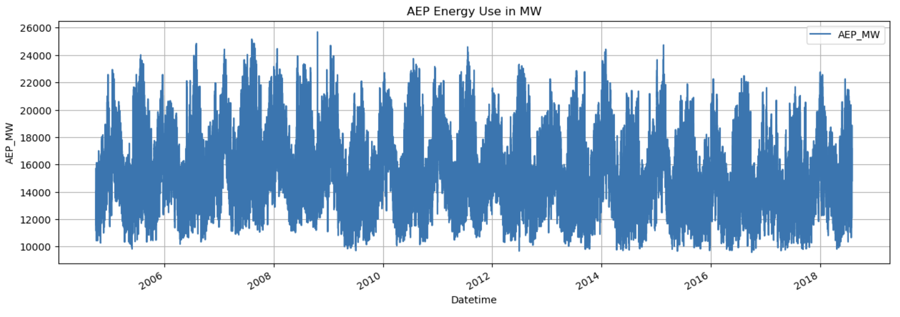
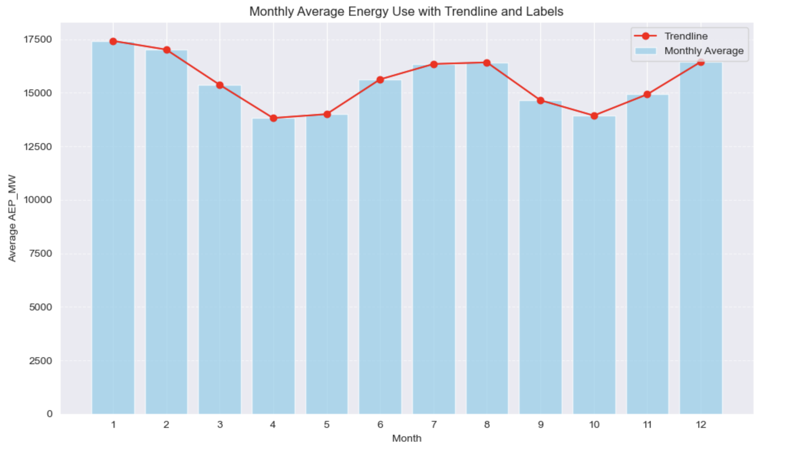
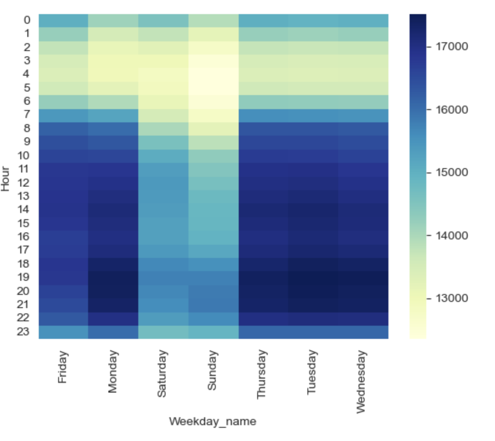
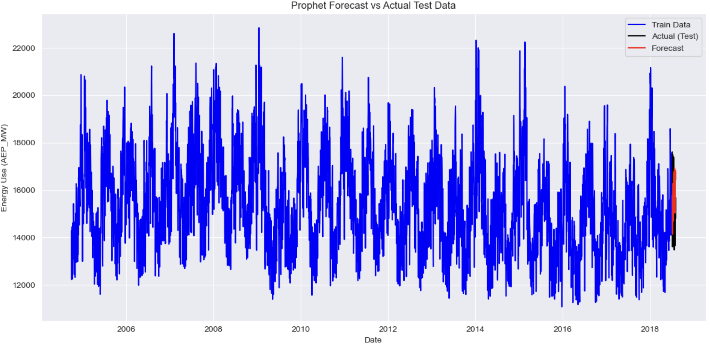

# AEP Energy Consumption Analysis and Forecasting

## 📌 Project Overview
This project explores the historical energy consumption patterns for the American Electric Power (AEP) dataset, identifies seasonal trends, and builds forecasting models to predict future usage.  
It combines **exploratory data analysis (EDA)** with **time series forecasting** techniques to provide insights into energy consumption behavior over time.

---

## 📊 Dataset
- **Source:** AEP (American Electric Power) hourly energy usage data
- **Columns:**
  - `Datetime` — timestamp of the observation
  - `AEP_MW` — energy usage in megawatts (MW)
- **Frequency:** Hourly data
- **Period Covered:** ~2004–2018

---

## 🎯 Objectives
1. Perform exploratory analysis to uncover daily, weekly, and seasonal patterns.
2. Compare weekday vs. weekend consumption behavior.
3. Develop forecasting models to predict short-term energy usage.
4. Visualize patterns and model outputs.

---

## 🔍 Exploratory Data Analysis (EDA)

### 1. **Overall Energy Usage Trend**
Displays the full time-series of energy consumption.

**Key Insights:**
- Strong yearly seasonality.
- Winter months generally show higher usage due to heating demand.
- Periodic peaks and troughs follow seasonal weather changes.

---

### 2. **Monthly Average Usage with Trendline**

**Observations:**
- Highest consumption in **January–February** and **July–August** (heating + cooling peaks).
- Lowest usage in **April–May** and **October**.

---

### 3. **Weekday vs Weekend Hourly Behavior**

**Findings:**
- **Morning peak** between 6–8 AM every day.
- **Mid-afternoon dip** in weekdays.
- **Weekends** show later peaks and slightly higher overnight usage.
- **Fridays** display a mix of weekday and weekend behavior.

---

## 📈 Forecasting

### Prophet Forecast vs. Actual Test Data

**Model Choice:** Facebook Prophet  
**Reason:** Handles seasonality and trend decomposition well, even with irregularities.

**Results:**
- Forecasted trends follow seasonal cycles closely.
- Short-term forecasts align with historical usage behavior.

---

## 🛠 Technologies Used
- **Python Libraries:** pandas, numpy, matplotlib, seaborn, prophet
- **Visualization:** Matplotlib, Seaborn
- **Forecasting:** Facebook Prophet

---

